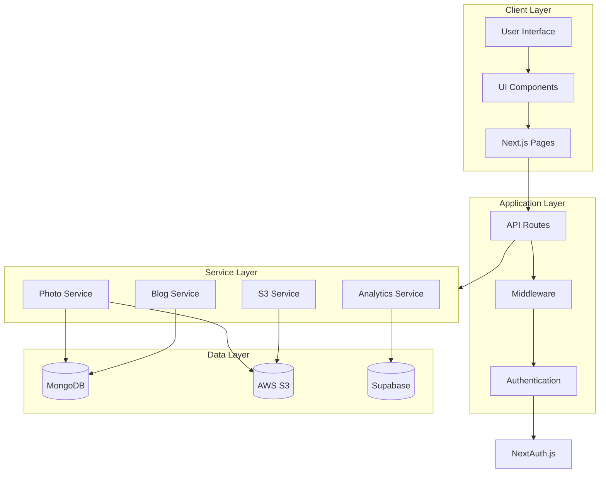

# David Dunn's Personal Website

My personal portfolio website built with Next.js 14, TypeScript, and Tailwind CSS.

## Features

- 🎨 Modern, responsive design
- 🌓 Dark/light mode support
- 📱 Mobile-first approach
- 📝 Blog section
- 📸 Photo gallery
- 🛠 Projects/Apps showcase
- 🔒 Authentication support

## Tech Stack

- **Framework:** Next.js 14
- **Language:** TypeScript
- **Styling:** Tailwind CSS
- **UI Components:** Radix UI & shadcn/ui
- **Database:** MongoDB & Supabase
- **Authentication:** NextAuth.js
- **Deployment:** Vercel

## Getting Started

1. Clone the repository:
```bash
git clone https://github.com/algorhythmic/daviddunn.tech.git
```

2. Install dependencies:
```bash
npm install
```

3. Create a `.env.local` file in the root directory and add your environment variables:
```env
MONGODB_URI=your_mongodb_uri
NEXT_PUBLIC_SUPABASE_URL=your_supabase_url
NEXT_PUBLIC_SUPABASE_ANON_KEY=your_supabase_anon_key
```

4. Run the development server:
```bash
npm run dev
```

5. Open [http://localhost:3000](http://localhost:3000) in your browser.

## Project Structure

```
daviddunn.tech/
├── public/           # Static files
├── src/
│   ├── app/         # App router pages
│   ├── components/  # React components
│   ├── lib/         # Utility functions
│   ├── types/       # TypeScript types
│   └── styles/      # Global styles
├── .env.local       # Local environment variables
└── package.json     # Project dependencies
```

## Architecture

The website follows a layered architecture pattern, with clear separation of concerns between different components. Here's a detailed view of the system architecture:



A static version of this diagram is also available: [View Architecture Diagram](docs/architecture-diagram.png)

### Architecture Overview

The application is structured into four main layers:

1. **Client Layer**
   - User Interface components built with React and Tailwind CSS
   - Reusable UI components using shadcn/ui and Radix UI
   - Next.js pages for routing and server-side rendering

2. **Application Layer**
   - API routes for handling HTTP requests
   - Authentication using NextAuth.js
   - Middleware for request processing and authorization

3. **Service Layer**
   - Photo management for gallery features
   - Blog service for content management
   - Analytics service for tracking site metrics
   - S3 service for file storage and retrieval

4. **Data Layer**
   - MongoDB for storing blog posts and photo metadata
   - AWS S3 for storing photo files
   - Supabase for analytics data

### Viewing the Architecture Diagram

To view the architecture diagram in VS Code:
1. Install the "Markdown Preview Mermaid Support" extension
2. Open this README.md file
3. Click the preview icon or press `Cmd+Shift+V` (macOS) / `Ctrl+Shift+V` (Windows/Linux)

## License

MIT © David Dunn
