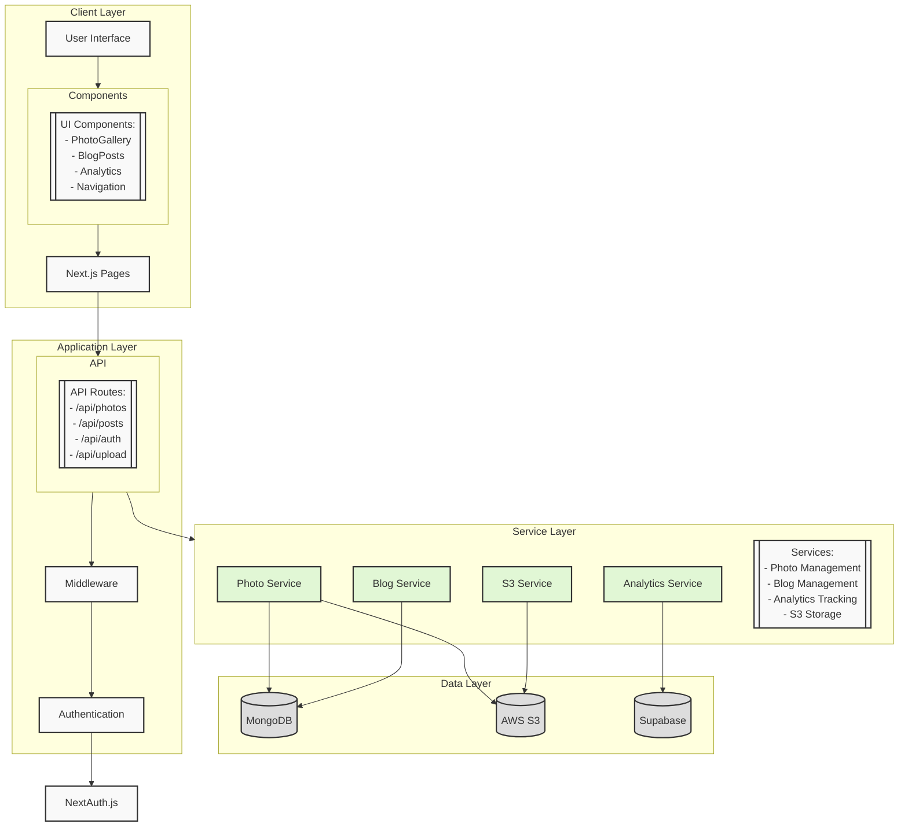

```mermaid
graph TB
    %% Client Layer
    subgraph Client ["Client Layer"]
        UI[User Interface]
        Components[UI Components]
        Pages[Next.js Pages]
    end

    %% Application Layer
    subgraph App ["Application Layer"]
        API[API Routes]
        Auth[Authentication]
        Middleware[Middleware]
    end

    %% Service Layer
    subgraph Services ["Service Layer"]
        PhotoService[Photo Service]
        BlogService[Blog Service]
        AnalyticsService[Analytics Service]
        S3Service[S3 Service]
    end

    %% Data Layer
    subgraph Data ["Data Layer"]
        MongoDB[(MongoDB)]
        S3[(AWS S3)]
        Supabase[(Supabase)]
    end

    %% Client Layer Connections
    UI --> Components
    Components --> Pages
    Pages --> API

    %% Application Layer Connections
    API --> Middleware
    Middleware --> Auth
    API --> Services

    %% Service Layer Connections
    PhotoService --> MongoDB
    PhotoService --> S3
    BlogService --> MongoDB
    AnalyticsService --> Supabase
    S3Service --> S3

    %% External Services
    Auth --> NextAuth[NextAuth.js]
    
    %% Component Details
    subgraph Components
        direction TB
        UI_Components[["UI Components:
        - PhotoGallery
        - BlogPosts
        - Analytics
        - Navigation"]]
    end

    %% API Routes Details
    subgraph API
        direction TB
        API_Routes[["API Routes:
        - /api/photos
        - /api/posts
        - /api/auth
        - /api/upload"]]
    end

    %% Service Details
    subgraph Services
        direction TB
        Service_Details[["Services:
        - Photo Management
        - Blog Management
        - Analytics Tracking
        - S3 Storage"]]
    end

    classDef default fill:#f9f9f9,stroke:#333,stroke-width:2px;
    classDef storage fill:#ddd,stroke:#333,stroke-width:2px;
    classDef service fill:#e1f7d5,stroke:#333,stroke-width:2px;
    class MongoDB,S3,Supabase storage;
    class PhotoService,BlogService,AnalyticsService,S3Service service;
```
